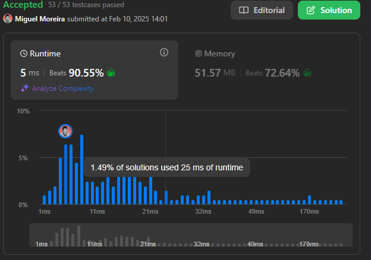
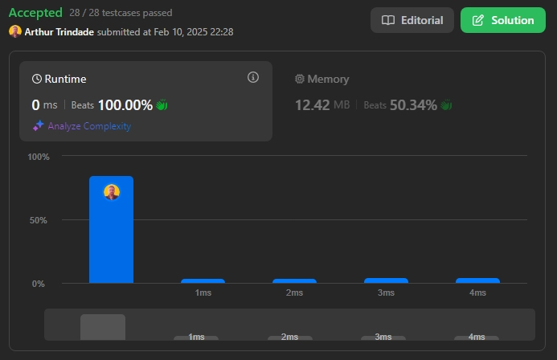
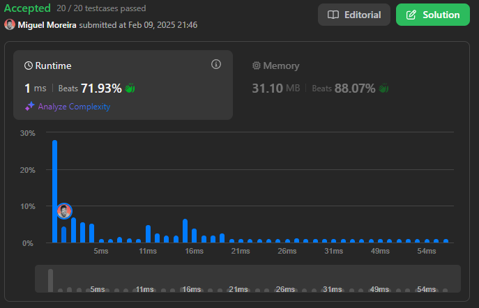

# Desafios LeetCode: Programação Dinâmica
 
**Conteúdo da Disciplina**: Programação Dinâmica 

## 👥 Alunos
| Matrícula   | Aluno           |
|-------------|------------------|
| 18/0098080  | Arthur Trindade  |
| 20/2023968  | Miguel Moreira   |

## 📝 Sobre
Este repositório contém a solução de desafios de Programação Dinâmica do juiz online LeetCode. Foram resolvidas as questões difíceis de números **1255** e **140**, e a questão de dificuldade média de número **894**.

**Tecnologias Utilizadas**: C, C++ e Python

### Desafios Solucionados
| Código | Desafio                                                                                                      | Dificuldade |
|--------|--------------------------------------------------------------------------------------------------------------|-------------|
| 1255    | [1255. Maximum Score Words Formed by Letters](https://leetcode.com/problems/maximum-score-words-formed-by-letters/description/) | Difícil     |
| 140    | [140. Word Break II](https://leetcode.com/problems/word-break-ii/description/) | Difícil     |
| 894    | [894. All Possible Full Binary Trees](https://leetcode.com/problems/all-possible-full-binary-trees/description/) | Média     |

## 📸 Screenshots

  

  Resultado da submissão da solução para o desafio 1255.

  

  Resultado da submissão da solução para o desafio 140.

  

  Resultado da submissão da solução para o desafio 894.

## 🚀 Uso
Para testar cada desafio:
1. Clique no link do desafio na tabela de questões da seção **Sobre**.
2. Cole o código referente ao desafio no campo de texto disponível na página do LeetCode.
3. Clique em **Run** para rodar a solução.

## 📚 Outros
  Este projeto visa exercitar conceitos de Programação Dinâmica, abordando diferentes níveis de dificuldade em problemas propostos no LeetCode.

## 🎥 Entrega de Vídeo

Para complementar a explicação das soluções e facilitar o entendimento dos conceitos aplicados em cada desafio, incluímos uma apresentação em vídeo.

### 📹 Link para o Vídeo
[Entrega de Programação Dinâmica (1255 e 894)](link)  
[Entrega de Programação Dinâmica (140)](link)
